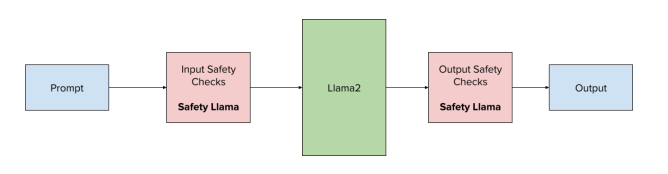

# Llama Guard standalone sample

## Requirements and installation
Access to the Llama Guard models

1. Unzip the file and change directory into it 
2. Install dependencies: `pip install -r requirements.txt`
3. You can run Input Safety Checks with this command: 
`python llamaguard_demo/test_safety_check.py  --ckpt_dir <path_to_model>  --tokenizer_path <path_to_tokenizer> --max_batch_size 6 --prompt "User: <prompt>"`
4. You can run Output Safety Checks with this commad: 
`python llamaguard_demo/test_safety_check.py  --ckpt_dir <path_to_model>  --tokenizer_path <path_to_tokenizer> --max_batch_size 6 --agent_type Agent --prompt "User: <user_prompt> Agent: <model_response_to_user_prompt>."`

## Overview

1. The model is loaded using plain Llama methods, present in the llama repo
2. The prompt template is lenghy, as can be seen in `PROMPT_TEMPLATE` in the `safety_check.py` script. For this reason, `max_seq_len` must be able to accomodate it, using 2048 by default.
3. The user validation starts with a `User: ` string and the Agent validation has both the user prompt and the model output, after the `Agent: ` string.